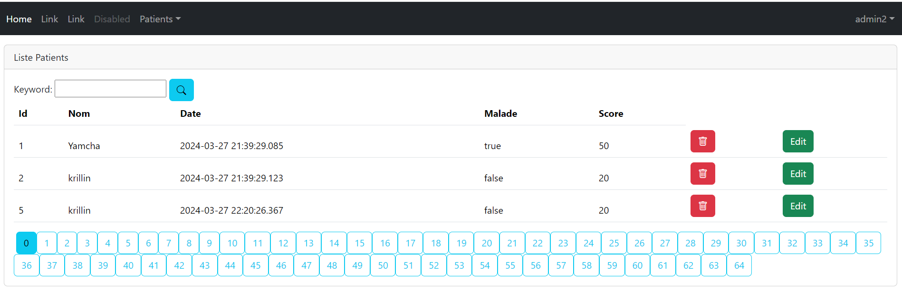

<h1>Compte rendu d'une App Hopital réalisée avec Spring MVC</h1>
<h2>Objectif du Tp</h2>

L'objectif de ce tp est de savoir créer une application
web basée sur Spring MVC qui permet de gérer les patients d'un hopital en implémentatnt les fonctionnalités suivantes et en utilisant MySQL: 
<i>Afficher les patients, faire la pagination, chercher un patient et supprimer un patient.</i>

<h2>Architecture du projet</h2>

<h2>Partie 1:</h2>
<h2>Notre classe Patient</h2>

<h2>Implementation H2 et MySQL</h2>

<h2>Ajout des patients avec 3 méthodes</h2>

<h2>Implémentation d'une méthode de recherche par nom</h2>

<h2>Controller Patient</h2>

Ce controleur implémente l'index et delete

<h2>Vue patient <i>HTML</i></h2>

<h2>Interface du index</h2>

<h2>Chercher un patient</h2>

<h2>Tentative du suppression</h2>

<h2>Partie 2:</h2>
<h2>Création des templates</h2>

<h2>Validation</h2>

<h2>Les interfaces avec les templates crées</h2>

